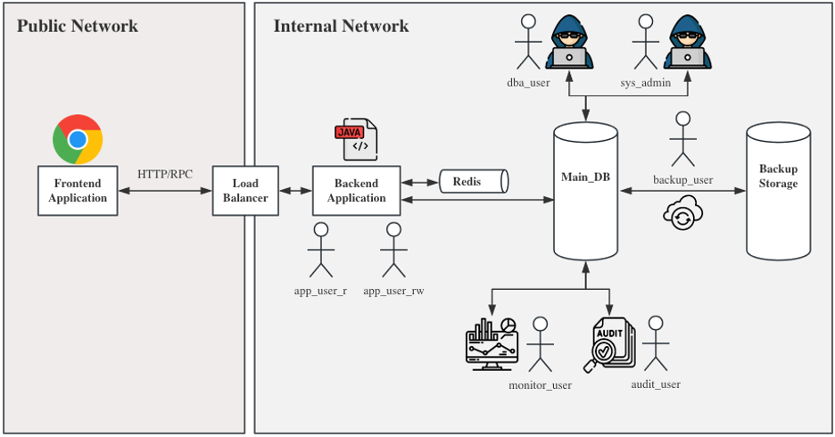

# ExamDB

## Architecture


## Database Desgin
Server Configurations:
- pg configurations: [config/postgresql](./config/postgresql.conf)
- hba configurations: [config/hba](./config/pg_hba.conf)
- pgAdmin: [config/pgAdmin](./config/pgadmin/servers.json)

Schema and Roles:
- RBAC: [sqls/rbac](./sqls/rbac/)
- Tables and Index: [sqls/ddl](./sqls/ddl/)

## Run MVP (Minimum Viable Product)
```shell
git clone https://github.com/lrx0014/ExamDB.git
cd ExamDB/docker

# clean previous mounted volumes
docker compose down -v

# start
docker compose up -d
```

Access to pgAdmin: `http://localhost:5050` (username: `test-admin@test-env.com`, password: `testadminpw`)
- password for the testing super user **app_owner**: `secretpw`

## Test Cases
### 1. Test HBA rules:
```shell
# access from a normal approved location (e.g. the sysadmin_console - 172.28.0.31)
# Password for user app_owner: secretpw
# this should succeed.
docker compose exec sysadmin_console psql -h pg -U app_owner -d exam_sys -c 'select 1;'

# access from an un-approved location (unknown_console - 172.28.0.99)
# you should get an error
docker compose exec unknown_console psql -h pg -U app_owner -d exam_sys -c 'select 1;'
```

### 2. Full Backup:
```shell
# check backup cron
docker compose exec backup_console cat /etc/crontabs/root


# run a manual full backup using backup_user role in backup_console (172.28.0.41)
docker compose exec backup_console sh -c \
  'PGPASSWORD=$PGPASSWORD PGUSER=$PGUSER PGHOST=$PGHOST PGDATABASE=$PGDATABASE \
   pg_dump -h $PGHOST -U $PGUSER -d $PGDATABASE -F c -f /backups/manual_$(date +%Y%m%d%H%M).dump'

# check the dump file
# you should see the manual_* dump files
docker compose exec backup_console ls -lh /backups
```

### 3. incremental backup (WAL Archiving)
```shell
# generate WAL by executing an INSERT
docker compose exec pg psql -U app_owner -d exam_sys -c \
  "CREATE TABLE IF NOT EXISTS wal_test(id int); INSERT INTO wal_test VALUES (1);"

# confirm WAL generated
# you should see some records
docker compose exec pg ls /var/lib/postgresql/wal-archive | tail

# wait 5 mins for the cron, then check the synced copies
# you should see the copied records
docker compose exec backup_console ls /backups/wal-archive
```

### 4. Application Test (Api Server)
```shell
# register a user
curl -X POST http://localhost:8080/api/auth/register \
  -H "Content-Type: application/json" \
  -d '{"email":"alice@example.com","password":"secret123","fullName":"Alice"}'

# login
curl -X POST http://localhost:8080/api/auth/login \
  -H "Content-Type: application/json" \
  -d '{"email":"alice@example.com","password":"secret123"}'

# query database to check generated row data
docker compose exec pg psql -U app_owner -d exam_sys -c \
  "SELECT * FROM auth.users;"
```